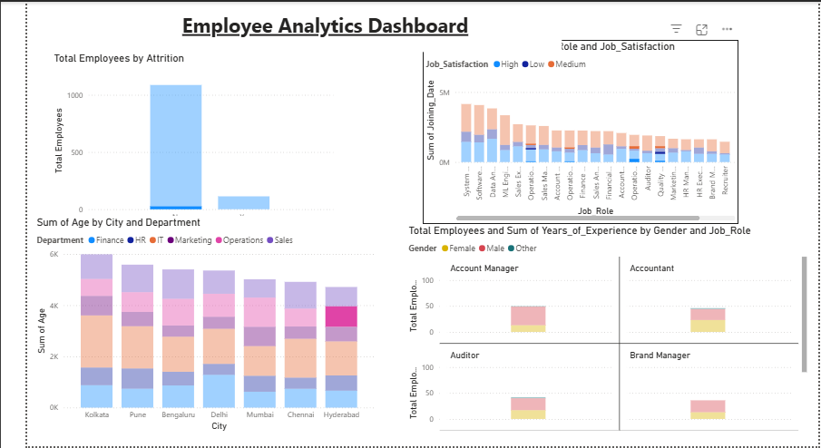

# Employee Analytics Dashboard

## 📊 Project Overview

An interactive Employee Analytics Dashboard built using **Microsoft Power BI, Excel and DAX** to analyze workforce demographics, compensation, performance and employee attrition.

## 🎯 Objectives

* Monitor total employee count
* Analyze salary distribution
* Compare employees across departments and cities
* Analyze employee attrition
* Understand the relationship between salary and experience
* Analyze workforce demographics and performance

## 🛠️ Tools & Technologies

* Microsoft Power BI
* Microsoft Excel
* DAX
* Data Visualization
* Data Analysis

## 📈 Dashboard Features

* Total Employees
* Average Salary
* Average Experience
* Attrition Rate
* Average Performance Rating
* Employees by Department
* Average Salary by Department
* Attrition by Department
* Employees by City
* Gender Distribution
* Education Distribution
* Salary vs Experience
* Attrition by Overtime

## 🔍 Interactive Filters

* Department
* Gender
* City
* Job Role
* Overtime

## 📂 Files

* `employee_anaytics_powerBi_dashboard.png` — Power BI dashboard template
* `Employee_Analytics_Cleaned.xlsx` — Dataset used for analysis

## 📌 Dashboard Preview

## 💡 Key Skills Demonstrated

Power BI dashboard development, Excel data handling, DAX measures, KPI development, data visualization, and business-oriented data analysis.

